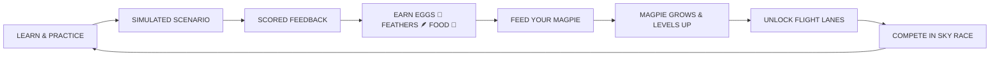

# Magpie AI — Gamified Workplace Learning MVP

> **"Your learning grows your Magpie."**  
> A production-grade web application MVP designed to transform professional workplace learning into an addictive, game-like companion experience. Built for Sandalwood Grand Hotels & Resorts.

---

## 🌟 Executive Summary & Concept

Traditional LMS platforms rely on boring dashboards, static compliance checklists, and meaningless badges. **Magpie AI** reimagines workplace training by introducing a persistent **3D/2.5D Magpie Character Engine** around voice-based AI scenario practice.

Every workplace interaction directly fuels your Magpie's progression:



---

## 🚀 Key Features

### 1. The Magpie is the Hero & AI Coach
- **Interactive 3D / 2.5D Rendering**: Built using Three.js WebGL and SVG shaders with volumetric lighting, mouse-follow tilt, wing-flap physics, specular eyes, glossy beak, and particle trails.
- **Dynamic Character Customizer**: "Meet your Magpie" onboarding allows users to select body color (*Obsidian Black, Sapphire Blue, Amethyst Purple, Emerald Green, Golden Amber*), feather style (*Sleek, Iridescent, Fluffy, Golden*), and starter accessories (*Studio Headphones, Concierge Glasses, Flight Cap, Silk Scarf*).
- **Growth & Evolution**: Visual leveling across 4 stages (*Baby Magpie 🐣, Young Magpie 🐦, Flying Magpie 🪽, Elite Magpie ✨*). Leveling up expands wing span, particle aura, and transforms character geometry.

### 2. Sandalwood Grand Practice Flow & AI Coach Conversation
- **Scenario Briefing**: Real workplace hospitality challenge (*"Wrong Charges at Checkout" — Guest: Mr. Iyer, ₹18k billing error, 90 mins before flight*).
- **Simulated Voice Conversation**: Multi-turn audio wave interface where associates practice crisis de-escalation, immediate refund holds, and executive transport arrangements.
- **Cinematic Reward Sequence**: Post-scenario sequence featuring score reveal (*8/10*), previous comparison (*6/10 → 8/10 "NEW PERSONAL BEST!"*), flight distance meter (*74m → 112m*), and reward item drops (*+3 Food, +2 Feathers, +1 Egg*).
- **Interactive Feeding**: Clicking "FEED YOUR MAGPIE" triggers food particles flying into the bird's beak, happy flap animations, and growth bar progression (`████████░░ 82%`).

### 3. Sky Race Arena & Flight Lanes
- **Flight Lanes System**: Replaces boring numeric leaderboards with visual sky lanes:
  - **PRACTICE LANE** (0-10 Eggs)
  - **FLIGHT LANE** (11-25 Eggs)
  - **BOOST LANE** (26-50 Eggs)
  - **GOLDEN LANE** (51+ Eggs)
- **Interactive Sky Race**: Parallax sky track with moving clouds, finish line, mock hotel associates (*Alex, Sarah, Vikram*), and an interactive **"FLY AGAIN (BOOST DISTANCE)"** booster button that accelerates the Magpie and increases flight distance records!

---

## 🛠️ Tech Stack & Architecture

- **Frontend Framework**: React 18 + TypeScript + Vite 5
- **3D & Graphics Engine**: Three.js (WebGL procedural mesh, studio lighting, mouse look-at, ambient particles) + Custom 2.5D SVG shaders
- **Animation & FX**: Framer Motion 11 + `canvas-confetti`
- **Styling & Aesthetics**: Tailwind CSS 3 (Luxury hospitality palette: cream backgrounds `#FAF8F5`, deep navy typography `#0F172A`, purple accents `#6D28D9`, gold elements `#D97706`) + Google Fonts (*Playfair Display*, *Plus Jakarta Sans*)
- **Icons**: Lucide React
- **Persistence Layer**: Clean `localStorage` abstraction layer (`src/utils/storage.ts`) ready for REST / GraphQL backend replacement.

---

## 💻 Running Locally

### Prerequisites
- Node.js `18.0.0` or higher
- npm `9.0.0` or higher

### Steps

```bash
# 1. Clone or navigate to the repository
cd magpie-ai-mvp

# 2. Install dependencies
npm install

# 3. Start local development server
npm run dev

# 4. Open in browser
# http://localhost:5173
```

---

## 📦 Production Build & Vercel Deployment

### Build Command
```bash
npm run build
```
This runs TypeScript checking (`tsc`) and compiles static assets via Vite into the `dist/` directory.

### Deploying to Vercel

1. Push this repository to GitHub.
2. Log into [Vercel](https://vercel.com) and click **"Add New Project"**.
3. Import the GitHub repository.
4. Framework Preset: **Vite**.
5. Build Command: `npm run build`.
6. Output Directory: `dist`.
7. Click **Deploy**.

---

## 🔍 Mocked vs. Future Production Roadmap

| Feature | MVP State (Current) | Production Target (Next) |
|---|---|---|
| **User Persistence** | `localStorage` state for Rashaad Syed | PostgreSQL DB via Firebase / Supabase |
| **Voice AI Conversation** | Interactive simulated multi-turn flow with realistic hotel dialogues | Live WebRTC / WebSocket ElevenLabs + Gemini 1.5 Flash Voice API |
| **Sky Race Multiplayer** | Simulated competitors (*Alex, Sarah*) with live distance boosting | Real-time WebSockets leaderboard with hotel department rooms |
| **Analytics & Reporting** | Local history & performance trends | Enterprise HRIS / LMS SCORM integration dashboard |

---

## 📄 License & Credits
Built for **Magpie AI** • Sandalwood Grand Hotels & Resorts Executive Presentation.
